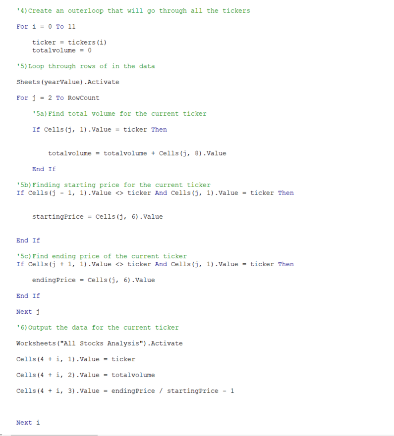
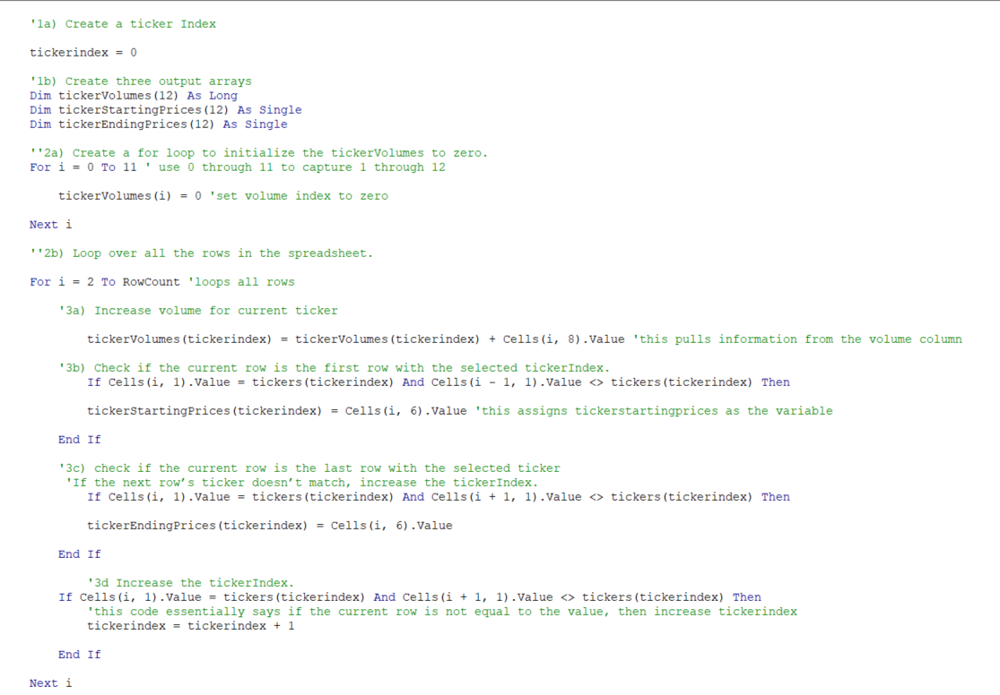
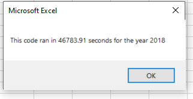
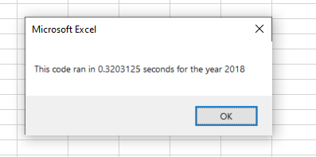

# Stock-Analysis
##### To view the excel file: [VBA_Challenge.xlsm](VBA_Challenge.xlsm)
---
## Overview
The purpose of this project was to create VBA coding within excel that would make it easier to filter through 2017 and 2018 data in determining what stocks were best suited to invest in. The data would be filtered down to show the ticker symbol, total daily volume, and the percent return of that ticker. The coding was created in a separate project. This project was to refactor the coding in a way that would make it more efficient and enhance the performance of the code allowing it to operate at a faster rate. 
## Results
When looking to increase the speed at which a code runs through VBA, we want to look at how we can make the coding shorter and more efficient.
A smaller code takes up less memory, therefore operating at a faster speed. First, I copied the first portion from the old code that included activation of the appropriate sheet, inputbox, timer, header, and the initial array of tickers as well as the variables for those tickers. The next step was to analyze the coding to see where short cuts could be made. Below is the original script. As you can see there are two variables.
### 
* In the new code, we have only one variable, making it easier and faster for the computer to process the information. Below is a snip of the coding that has been updated with objectives and notes as to what the coding does and why it's being used.
### 
By shortening the data down, the performance of the code is now faster than it was before. 
* Code speed of original code
# 
* Code speed after refactory.
# 

## Summary
### Advantages and Disadvantages of Refactoring
Refactoring coding can have some serious benefits. A few of the major advantages to refactoring coding is to make the script easier to read or understand, can improve the design, help find bugs, and can increase the speed of the programming and/or software. On the contrary, refactoring coding can be extremely time consuming and can cause underlying issues with the softeware or programming applications that are involved if the files are too large. Either way, it should be noted to take caution when refactoring and pay close attention to detail! 
### Pros and Cons of Refactoring this VBA Script
The biggest benefit out of refactoring this script was the performance boost it received. It's code speed dropped significantly from the original script. The only disadvantage to this refactory was that it took a good deal of time to determine how the coding was going to be improved. Some trial and error until the right formula was put into place.
